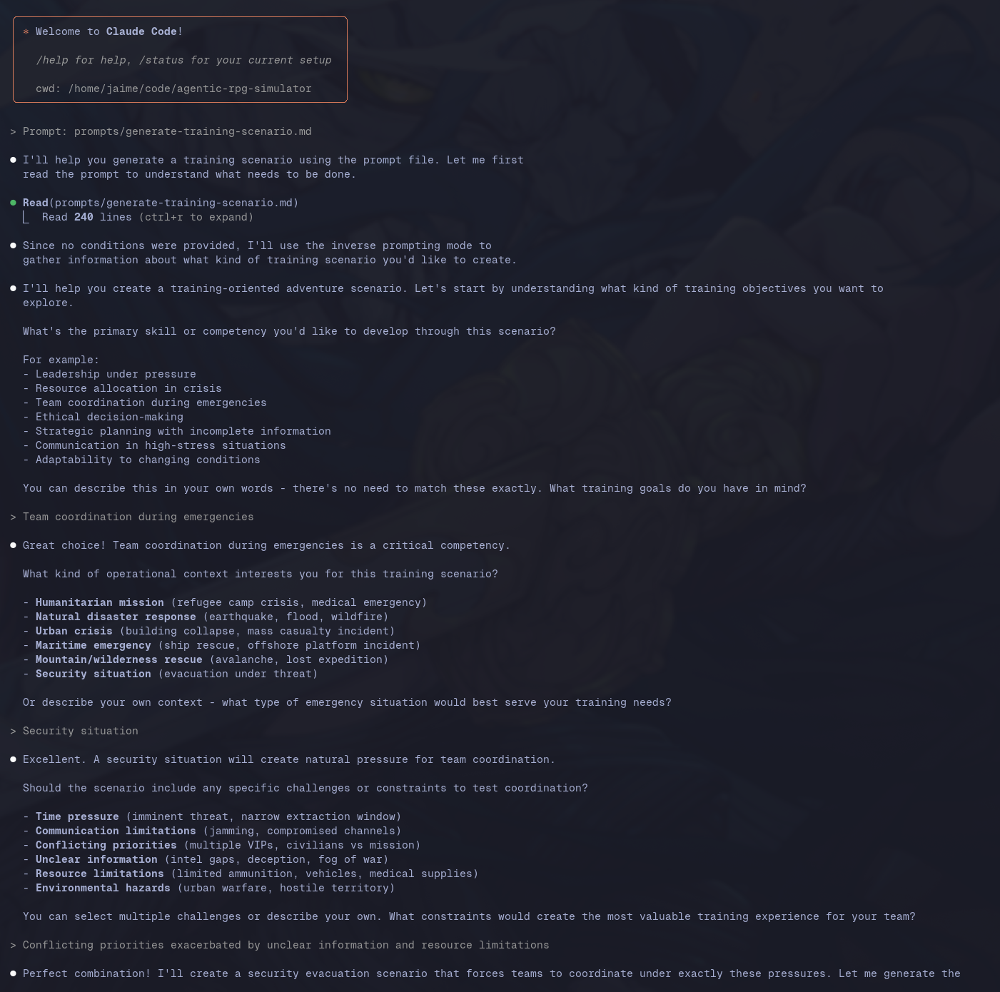

# Development Modernization

> The best time to plant a tree was 20 years ago. The second best time is now.

This document captures some the foundational research repositories driving this modernization initative. See [Google SRE Book - Eliminating Toil](https://sre.google/sre-book/eliminating-toil/) for the motivation behind this initiative beyond just establishing a modernized, operationally effective digital ecosystem.

## Operating System

I've transitioned from Windows to Linux. Initially, I was operating on an Ubuntu-based distribution of Linux, but have recently switched to [Omarchy](https://learn.omacom.io/2/the-omarchy-manual/91/welcome-to-omarchy). It is a distribution based on [Arch Linux](https://archlinux.org/) and the tiling window manager [Hyprland](https://hypr.land/). See [Omarchy 2.0](https://www.youtube.com/watch?v=TcHY0AEd2Uw) for an overview of Omarchy and why it is a great leap forward in personal computing not just for developers, but for everyone.

Computers should be intuitive and joyful to use, being comprised of what you want / need and nothing more. They should enable you to operate effectively and securely without constraining your ability to be productive. Their ecosystem should provide you access to the best tools available for achieving your tasks, freeing up your production teams to build truly bespoke capabilities tailored to your organization.

## Projects

### [Cipher Flux](https://github.com/JaimeStill/cipher-flux)

A full-stack encryption middleware transport pipeline providing transparent HTTP request/response encryption.

This is the project that kick-started this entire thought process. I was initially just seeking to establish a secure application-layer transport protocol between a web client and a web server, and it turned into my initial exposure to AI-augmented development. The question that initially hit me was "Could I get Claude to help me learn the Go programming language by porting my .NET implementation?". The result was a resounding yes, and I started to truly understand the utility of how agentic workflows can supercharge development efficiency.

Repository links:
- [Architecture](https://github.com/JaimeStill/cipher-flux/blob/main/architecture.md): detailed capability documentation.
- [Memory](https://github.com/JaimeStill/cipher-flux/tree/main/_memory): agentic workflow context illustrating the Go implementation development effort.

### [Applied Go Programming](https://github.com/JaimeStill/applied-go-programming)

A comprehensive Go programming learning path built with the Agentic Exercise Curriculum System (AECS) aimed at teaching the Go programming language.

Create Plan Initialization | Create Plan Strategy
---------------------------|---------------------
 | 

This project was an experiment in establishing an agentic workflow for learning difficult technical subjects in a practical way. The [AECS Framework](https://github.com/JaimeStill/applied-go-programming/tree/main/_framework#agentic-exercise-curriculum-system-aecs) provides pre-structured prompts and artifact templates for initializing a training plan based on a desired subject of study. This is where I really started to learn the power of engineering generative agentic systems.

Repository links:
- [Framework Documentation](https://github.com/JaimeStill/applied-go-programming/tree/main/_framework): defines the AECS framework and includes all of the artifacts necessary for initializing a new training plan from scratch using [Claude Code](https://docs.anthropic.com/en/docs/claude-code/overview) and its [Subagents](https://docs.anthropic.com/en/docs/claude-code/sub-agents) feature.
- [Example Training Plan](https://github.com/JaimeStill/applied-go-programming/tree/main?tab=readme-ov-file#exercise-driven-learning-path): a training plan focused on learning the Go programming language.
- [Example Stage](https://github.com/JaimeStill/applied-go-programming/tree/main/stages/01-fundamentals): training plans are broken into stages composed of a series of exercies.
- [Example Exercise](https://github.com/JaimeStill/applied-go-programming/blob/main/stages/01-fundamentals/03-basic-functions.md): exercises provide practical, guided lessons that allow you to learn through execution.

### [Agentic RPG Simulator](https://github.com/JaimeStill/agentic-rpg-simulator)

A lightweight, token-efficient RPG adventure engine that processes narrative events within strict context boundaries. Each adventure unfolds through a series of discrete events, with character decisions and world state compressed between scenes.

Generate Scenario | Generated Scenario (1) | Generated Scenario (2)
------------------|------------------------|-----------------------
 |  | 

This project started as a Saturday morning coding challenge exploring the idea of simulated role playing using [Subagents](https://docs.anthropic.com/en/docs/claude-code/sub-agents). Through exploring this concept, I was able to extend the functionality of the original vision to include simulation of operational military traning scenarios. The idea here is that the main agent is responsible knowing and executing the simulation rules. The subagents generated for any given scenario are responsible for reacting to each event that unfolds within the scenario, providing unique perspectives and insights.

This repository is also where the idea for the intelligent operations platform was initially conceived.

Repository links:
- [CLAUDE.md](https://github.com/JaimeStill/agentic-rpg-simulator/blob/main/CLAUDE.md): the main Claude Code [Memory file](https://docs.anthropic.com/en/docs/claude-code/memory) standardizing the simulation engine mechanics.
- [schemas](https://github.com/JaimeStill/agentic-rpg-simulator/tree/main/schemas): data formats for simulation data.
- [prompts](https://github.com/JaimeStill/agentic-rpg-simulator/tree/main/prompts): core simulation generation prompts.
- [scenarios](https://github.com/JaimeStill/agentic-rpg-simulator/tree/main/scenarios): generated scenarios that can be used to initialize an adventure (simulation).
- [adventures](https://github.com/JaimeStill/agentic-rpg-simulator/tree/main/adventures): simulations generated from scenarios.
  - [Operation Underground](https://github.com/JaimeStill/agentic-rpg-simulator/tree/main/adventures/operation-underground-20250803): sample training simulation.
  - [Operation Underground Subagents](https://github.com/JaimeStill/agentic-rpg-simulator/tree/main/.claude/agents/runtime/operation-underground-20250803)
- [Simulation Architecture](https://github.com/JaimeStill/agentic-rpg-simulator/blob/main/.admin/architecture.md): detailed documentation for simulation mechanics.
- [Operational Simulator](https://github.com/JaimeStill/agentic-rpg-simulator/blob/main/.admin/operational-simulator.md): detail military operations simulation extension.
- [Intelligent Operations Platform: Core Architecture Concepts](https://github.com/JaimeStill/agentic-rpg-simulator/blob/main/.admin/intelligent-operations-platform.md): initial conception of intelligent operations platform.
- [Case Study: Non-Deterministic Systems Architecture in Agentic RPG Simulator](https://github.com/JaimeStill/agentic-rpg-simulator/blob/main/.admin/case-study_non-deterministic-systems.md): analyzes the Agentic RPG Simulator as a pure non-deterministic system.

### [Go Agents](https://github.com/JaimeStill/go-agents)

A model-independent AI agent primitive for building composable, functional agentic AI workflows in Go.

After building an intuition for working with Claude, building a firm understanding of the open source infrastructure and standards surrounding the emerging AI space, and getting comfortable with developing in Go, I wanted to take a stab at building a primitive agent library that is not tied to any particular platform or model. Instead, you specify which platform and model the agent is configured with, and it will use an embedded LLM client to interface with the model. Then, building on top of the agent primitive, multiple agents can be composed together in a concurrent manner and integrated into traditional development infrastructure to enable agentic processes.

This project is being built initially to run self-hosted models directly in a container on the development machine.

Repository links:
- [CLAUDE.md](https://github.com/JaimeStill/go-agents/blob/main/CLAUDE.md): AI-augmented pair programming directives.
- [PROJECT.md](https://github.com/JaimeStill/go-agents/blob/main/PROJECT.md): project roadmap.
- [docker-compose.yml](https://github.com/JaimeStill/go-agents/blob/main/docker-compose.yml): ollama docker stack with GPU access; initialized with llama3.2:3b and setup with a volume for model caching.
- [examples](https://github.com/JaimeStill/go-agents/tree/main/examples): test examples for validating agent feature behavior.

### [Snippetbox](https://github.com/JaimeStill/snippetbox)

A Go-based web application for storing and retrieving text snippets. Companion app for the book [Let's Go](https://lets-go.alexedwards.net/) by [Alex Edwards](https://github.com/alexedwards).

After developing with Go in the previous projects, I wanted to take some time to establish a more comprehensive understanding of patterns and best practices, as well as evaluate the effectiveness of Go for developing web applications. The ability for Go to compile down to machine-level cross-platform executables is incredibly powerful, and its ability to cleanly integrate into small, secure containers (such as [Alpine Linux](https://alpinelinux.org/about/)) is a very attractive prospect. Additionally, I wanted to evaluate the effectiveness of transitioning away from Node.js-based front-end frameworks in favor of a more simple web application platform that enables effective integration with core web standards. If the front-end framework ecosystem is currently focused on transitioning to server-side rendering (SSR) with hydration, why not just use an actual systems programming language for a server that hosts native web content?

Repoistory links:
- [MySQL Container](https://github.com/JaimeStill/snippetbox/blob/main/docker-compose.yml): the MySQL server container that provides data persistence to the web application.
- [sql](https://github.com/JaimeStill/snippetbox/tree/main/sql): SQL scripts used to initialize the snippetbox database and MySQL web login.
- [ui](https://github.com/JaimeStill/snippetbox/tree/main/ui): web application front-end infrastructure embedded into a virtual filesystem.
- [internal](https://github.com/JaimeStill/snippetbox/tree/main/internal): internal web application models and validation code.
- [cmd/web](https://github.com/JaimeStill/snippetbox/tree/main/cmd/web): web application server code.

### [Agent Builder](https://github.com/JaimeStill/agent-builder)

A Go-based web server for building Ollama-based agents.

Starting to establish integration patterns for being able to manage a self-hosted Ollama instance through a web API. Intent is to integrate the agent primitive established in the Go Agents project above and use them to provide intelligent processing within a traditional web service. This project will enable you to build your own agents connected to any Ollama model that you can effectively host on local hardware.

Repository links:
- [docker-compose.yml](https://github.com/JaimeStill/agent-builder/blob/main/docker-compose.yml): ollama docker stack with GPU access; utilizes same volume as Go Agents for efficient model caching.
- [pkg/ollama](https://github.com/JaimeStill/agent-builder/tree/main/pkg/ollama): ollama API client package.
- [cmd/web](https://github.com/JaimeStill/agent-builder/tree/main/cmd/web): web server.
- [Ollama Guide](https://github.com/JaimeStill/agent-builder/blob/main/.docs/ollama-guide.md): ollama API guide.

### [Omarchy Theme Generator](https://github.com/JaimeStill/omarchy-theme-generator)

A Go-based TUI app for generating Omarchy themes from a provided picture using intelligent color extraction and color theory principles.

A weekend project I started to iron out the [Intelligent Development](./intelligent-development.md) methodology.
